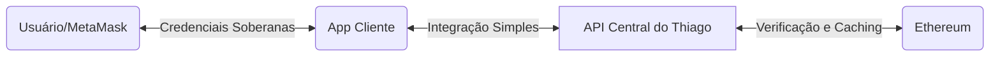
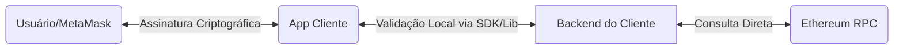

# Discussão Arquitetural: Centralização do Sistema vs. Descentralização dos Dados

Essa sua pergunta toca no **ponto central da discussão de arquitetura de software na Web3 (frequentemente chamada de Web 2.5)**. 

Sim, o seu argumento **faz total sentido técnico e de negócios**, e inclusive é o modelo utilizado por grandes empresas de infraestrutura Web3 hoje (como *Web3Auth*, *Privy*, *Dynamic.xyz* e o próprio *Auth0* com conexões Web3).

No entanto, há um embate clássico entre a **praticidade da Engenharia de Software (sua visão)** e o **rigor da soberania criptográfica (visão do seu orientador)**. Para o seu TCC, a melhor estratégia é **não descartar nenhuma das duas visões, mas sim documentá-las e compará-las formalmente**. Isso demonstrará um nível de maturidade acadêmica excelente para a banca.

Abaixo, faço uma análise profunda de ambas as abordagens para você entender os argumentos e poder debater com seu orientador ou usá-los no texto do seu artigo.

---

## 1. O Modelo "Web 2.5" (Sua Visão)
**Conceito:** O sistema de autenticação (API) é um gateway centralizado, mas as credenciais (chaves privadas, senhas, dados de identidade) permanecem sob posse soberana do usuário (na MetaMask) e na blockchain.

*   **Por que faz sentido:**
    *   **Abstração Máxima:** O desenvolvedor Web2 não precisa instalar bibliotecas criptográficas complexas de curvas elípticas no servidor dele. Ele apenas faz requisições REST para a sua API e recebe um JWT padrão.
    *   **Performance:** A API centralizada pode fazer cache de estados da blockchain (ex: verificar se o usuário ainda possui um NFT de acesso) sem precisar consultar a rede Ethereum (que é lenta e cara) a cada requisição.
    *   **Gerenciamento de Estado:** Facilita recursos como rotação de chaves de sessão, revogação de tokens e auditoria centralizada.
*   **O problema (Crítica do Orientador):**
    *   **Terceiro de Confiança (Trusted Third Party):** O desenvolvedor do app cliente precisa confiar que a sua API está realmente validando as assinaturas. Se a sua API for comprometida, o hacker pode emitir JWTs falsos para qualquer endereço Ethereum, ignorando a MetaMask do usuário.
    *   **Privacidade:** Sua API central monitora todas as autenticações de todos os aplicativos parceiros, rastreando quando e onde o usuário logou (o que fere a privacidade da identidade auto-soberana).

---

## 2. O Modelo "Web 3.0 Puro" (Visão do Orientador)
**Conceito:** O sistema e os dados são descentralizados. A validação criptográfica ocorre de ponta a ponta sem intermediários.

*   **Por que faz sentido:**
    *   **Zero Confiança (Zero-Trust):** O aplicativo valida a assinatura criptográfica localmente usando funções matemáticas. Ele não precisa confiar em nenhum servidor externo (como o seu).
    *   **Indestrutibilidade (Resiliência):** Se o seu servidor cair, o sistema de login das aplicações clientes continua funcionando normalmente, pois eles dependem apenas da rede descentralizada Ethereum e do código local deles.
*   **O problema:**
    *   **Complexidade de Integração:** O desenvolvedor backend precisa importar pacotes pesados de web3 e configurar a conexão com nós da blockchain (RPC).

---

## Como usar isso para blindar o seu TCC (A Solução Híbrida)

Para enriquecer o seu trabalho e satisfazer a banca, a melhor saída é **desenvolver o projeto como um SDK de duas camadas**, que permite ao desenvolvedor escolher qual modelo usar. 

Você pode estruturar o seu código e o seu artigo assim:

1.  **O Core da Criptografia (Biblioteca/Lib):**
    Você desenvolve a lógica de validação de assinaturas ECDSA e geração de nonces em uma **biblioteca pura** (ex: um pacote Java/Spring ou NPM).
2.  **A API REST (Abstração):**
    Você empacota essa biblioteca dentro de um serviço de API. 
3.  **A Discussão Científica no Artigo:**
    No seu texto (Capítulo de Arquitetura/Resultados), você dedica uma seção inteira para discutir:
    *   *Abordagem A (API Centralizada)*: Focada em facilidade de integração e sistemas legados Web2.
    *   *Abordagem B (Biblioteca Distribuída)*: Focada em aplicações puramente descentralizadas (dApps) e soberania de dados.

> [!TIP]
> **Como responder ao seu orientador:**
> *"Professor, o senhor tem razão no ponto de que uma API centralizada introduz um intermediário na arquitetura. Para resolver isso, estruturei o projeto de forma que o núcleo da autenticação seja uma **biblioteca de código reutilizável (SDK)**. O desenvolvedor terá duas opções: rodar essa biblioteca localmente em seu próprio servidor (garantindo descentralização total e zero-trust) ou consumi-la como uma API REST dedicada caso precise de uma integração rápida de microsserviços."*

Essa resposta é muito madura porque você reconhece a crítica dele, mostra que a arquitetura do seu código resolve o problema técnico de forma modular e ainda mantém a flexibilidade da API REST.

O que acha dessa abordagem para a escrita do seu TCC e para a implementação?
