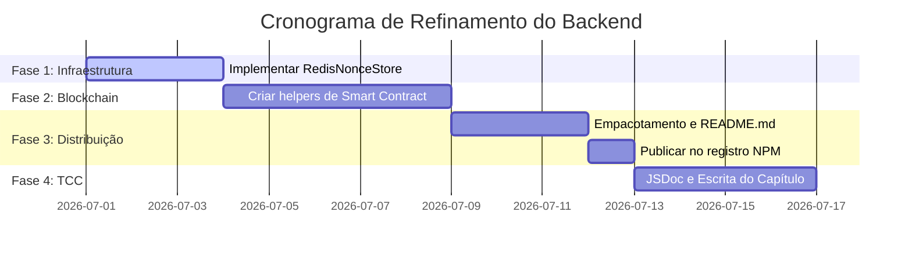

# Roteiro de Próximos Passos: Backend Pronto e Reutilizável

Este roteiro descreve as etapas necessárias para refinar o backend do seu TCC, transformando o protótipo funcional em uma **biblioteca de nível de produção (SDK)** 100% reutilizável, modular e pronta para ser adotada por qualquer projeto.

---

## 🚀 Fase 1: Desacoplamento e Infraestrutura de Nonce (Escalabilidade)

O armazenamento temporário em memória (`MemoryNonceStore`) funciona para demonstrações locais, mas falha em ambientes reais com múltiplos servidores (load balancers) ou serverless (AWS Lambda).

### Passos:
1.  **Suporte a Redis (`RedisNonceStore`):**
    *   Criar uma classe no SDK que estende a interface `NonceStore` para ler/escrever em uma base Redis.
    *   Redis gerenciará a expiração (TTL) de forma nativa e descentralizada entre os servidores.
2.  **Interface de Nonce Genérica:**
    *   Garantir que a biblioteca permita ao desenvolvedor injetar qualquer banco de dados (PostgreSQL, MongoDB) apenas implementando a interface `NonceStore`.

---

## 🔗 Fase 2: Integração com Smart Contracts (Validação On-chain)

Para cobrir a seção de **Contratos Inteligentes** do seu referencial teórico, o SDK deve ir além de "provar a posse da carteira" e permitir verificar regras de negócios armazenadas na blockchain.

### Passos:
1.  **Token-Gating / NFT-Gating Helper:**
    *   Implementar métodos utilitários no SDK backend que leem a blockchain (via RPC da Ethereum/Polygon) para verificar se o endereço autenticado possui um token específico (ERC-20 ou ERC-721/NFT) necessário para acessar o sistema.
2.  **Verificação de Permissões On-chain:**
    *   Criar um helper para ler funções de um Smart Contract de ACL (Access Control List) implantado por você na testnet Sepolia, validando os "roles" (ex: admin, manager) do endereço.

---

## 📦 Fase 3: Empacotamento e Distribuição da Biblioteca

Para o SDK ser considerado reutilizável de verdade, os desenvolvedores precisam conseguir instalá-lo com um simples comando `npm install`.

### Passos:
1.  **Publicação no Registro NPM:**
    *   Configurar o `package.json` da biblioteca com palavras-chave, licença MIT e metadados.
    *   Preparar o build de produção compilando o TypeScript para JavaScript puro (`dist/index.js`) com as declarações de tipo `.d.ts`.
    *   Publicar o pacote (pode ser público ou privado/escopado como `@thiago/tcc-auth-sdk`).
2.  **Criação do README do SDK:**
    *   Escrever uma documentação rica contendo:
        *   Instruções de instalação.
        *   Exemplo rápido de integração no Express.
        *   Guia de como estender e customizar o armazenamento de nonces.

---

## 📝 Fase 4: Documentação Acadêmica (Para a Banca do TCC)

A banca vai avaliar a qualidade do código sob a ótica de engenharia de software.

### Passos:
1.  **Documentação JSDoc Completa:**
    *   Documentar todas as classes, métodos e parâmetros do SDK utilizando padrões JSDoc, permitindo que IDEs autocompletem as funções para o desenvolvedor com explicações de segurança.
2.  **Seção de Análise de Ameaças no Artigo:**
    *   Documentar as defesas criptográficas (curvas elípticas, assinaturas digitais, prevenção a ataques de replay) que você implementou no código da biblioteca.

---

## 🛠️ Cronograma de Ações Proposto

